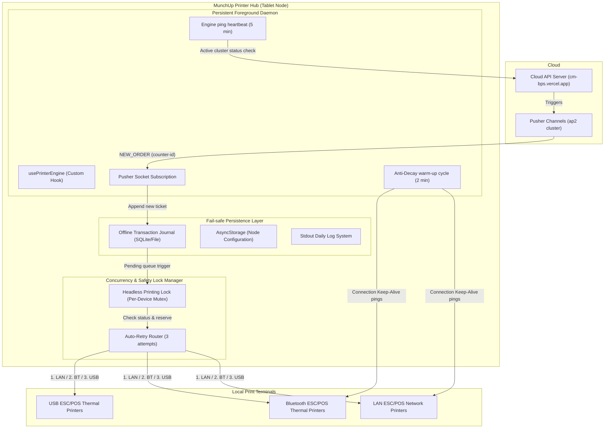

# MunchUp Printer Hub


[](https://www.typescriptlang.org/)
[](https://reactnative.dev/)
[](https://pusher.com/)
[](https://opensource.org/licenses/MIT)

**MunchUp Printer Hub** is an enterprise-grade React Native print management engine and agent designed for high-concurrency food courts and kiosks. It maintains a persistent, fail-safe foreground background service that routes real-time customer order tickets from Pusher Websockets directly to physical ESC/POS receipt printers (via Bluetooth, USB, and LAN).

---

## System Architecture

The agent is designed to run on a dedicated tablet station at the kiosk counter. It acts as an autonomous broker between cloud transaction servers and local POS printing hardware:



---

## Key Features

- **Zero-Decay Foreground Service**: Utilizes a persistent Android foreground background daemon to keep socket listeners active and prevent mobile OS suspension of the print thread.
- **Headless Printing Lock (Mutex)**: Employs standard device-level mutexes to prevent concurrent layout overlaps or socket collisions when multiple print streams target the same physical node.
- **Anti-Decay Warm-up Cycles**: Regularly pings connected Bluetooth and USB printers every 2 minutes to prevent automatic device sleeps or connection drops.
- **Auto-Retry Pipeline**: Implements a robust 3-stage retry matrix with fallback safety mechanisms. Unsuccessful prints are flagged back to cloud databases to trigger safety cash refunds.
- **Autonomous Preemption Weighting**: Uses node-level priorities to resolve conflicts when multiple tablet instances bind to the same printer channels (Preemption guards).

---

## Codebase Organization

The codebase has been refactored for strict separation of concerns, separating views, state controllers, and native drivers:

```
├── App.tsx                        # App entry point (composes layout and injects hooks)
├── components/                    # UI Component System
│   ├── theme.ts                   # Theme token palette & type configs
│   ├── Pill.tsx                   # Interactive status badges
│   ├── Divider.tsx                # Layout separators
│   ├── SectionLabel.tsx           # Monospace list headers
│   ├── CollapsibleSection.tsx     # Animated slide-open accordion views
│   ├── RegisteredCounterCard.tsx  # Maps counter layouts to active printers
│   ├── DiscoveredPrinterCard.tsx  # Unlinked printer pairing & mapping forms
│   ├── TicketCard.tsx             # Renders individual order summaries & retry controls
│   ├── EngineConfigModal.tsx      # Configures node identifiers & priority ranks
│   ├── QueueTab.tsx               # Active print queues & Pusher socket status monitors
│   ├── HardwareTabContent.tsx     # Handles scanning states and static IP mounting
│   └── LogsTab.tsx                # Console logger output console
├── hooks/
│   └── usePrinterEngine.ts        # Custom hook isolating websockets, state machines, and effects
├── utils/
│   ├── printingHelpers.ts         # Mock tickets, permissions, and raw print dispatch helpers
│   ├── printerDiscovery.ts        # Bluetooth, USB, and LAN hardware scanner controls
│   ├── printerTransport.ts        # Native ESC/POS socket connection warmers & payload encoders
│   ├── ticketStorage.ts           # SQLite/AsyncStorage sync controls and journal file syncs
│   ├── logger.ts                  # Persistent Daily logs writers & readers
│   ├── engineConfig.ts            # Node priority config readers
│   └── engineState.ts             # Active caching and status stores
└── types.ts                       # Domain types (Ticket, CounterConfig, etc.)
```

---

## Getting Started

### Prerequisites

- Node.js (>= 22.11.0)
- React Native CLI development environment configuration (Android SDK / Ruby / CocoaPods)
- A physical Android/iOS tablet or debugger device supporting Bluetooth/USB OTG

### Setup & Installation

1.  **Clone the Repository**:

    ```bash
    git clone https://github.com/imvbhargav/canteen-printer-hub.git
    cd canteen-printer-hub
    ```

2.  **Install Dependencies**:

    ```bash
    pnpm install
    # OR using npm
    npm install
    ```

3.  **Install Native iOS Modules (Mac only)**:
    ```bash
    bundle install
    bundle exec pod install
    ```

---

## Running the Application

### 1. Start Metro Bundler

Start the Metro JavaScript packager:

```bash
npm start
```

### 2. Build and Deploy to Debugger Device

#### Android

Ensure your debugger tablet is attached via `adb devices`:

```bash
npm run android
```

#### iOS

```bash
npm run ios
```

---

## Development & Quality Assurance

This codebase is checked for type-safety and syntax formatting consistency:

### Run Linter

We use ESLint configured to enforce code style requirements:

```bash
npm run lint
```

### Run TypeScript Compilation Check

Verify type definitions across all custom hooks, props, and components:

```bash
npx tsc --noEmit
```

### Run Unit Tests

```bash
npm test
```

---

## Configuration Reference

### Node Instance Configurations

To provision a tablet station, tap the **Gear icon (⚙)** on the top right dashboard header to configure:

- **Persistent Node Instance ID**: Unique identifier for this physical kiosk dashboard (e.g., `Engine-Kiosk-Tab1`).
- **Cluster Priority Weighting**: Ranks tablets in case of cluster overlaps. Higher values supersede active subscriptions.

---

## Contribution Guidelines

We welcome contributions from the open-source community to improve printer drivers and network resilience:

1. Fork the Project.
2. Create your Feature Branch (`git checkout -b feature/ResilientLAN`).
3. Commit your Changes (`git commit -m 'Add support for raw network sockets'`).
4. Push to the Branch (`git push origin feature/ResilientLAN`).
5. Open a Pull Request.
